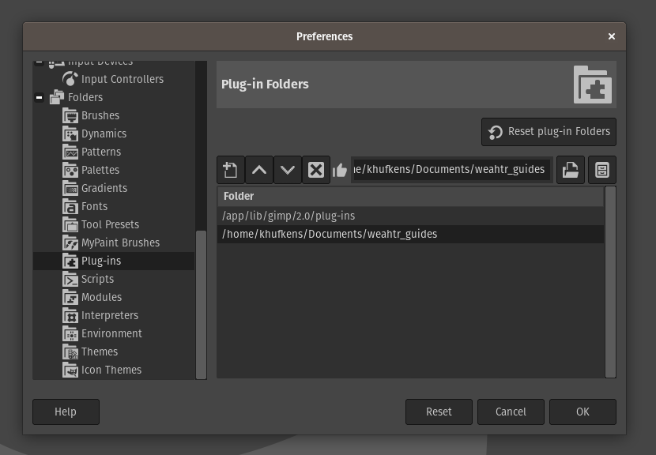

# Saves guides for the weahtr ML workflow

This GIMP plug-in complements the weaHTR ML workflow for automated climate data recovery. When creating a table template the plug-in allows you to export the boundaries of rows and columns, or singlular regions of interest.

## Install

Download the plugin using the [following link](https://github.com/khufkens/weahtr_guides/archive/refs/heads/master.zip), and unzip the downloaded file. Alternatively, clone the repository with git:

```bash
git clone https://github.com/khufkens/weahtr_guides.git
```
Next, make the python script executable by setting the correct permissions. In Unix based systems this can be done using the following command line code:

```bash
chmod +x weahtr_guides.py
```

Right clicking on the file to access the file options will generally give access to similar setting across various operating systems.

### GIMP settings

For this plug-in to work you will need a recent GIMP version (2.10), and the flatpak version of GIMP when using linux (to ensure python 2.7 support).

To activate the plug-in, open the GIMP preferences using the `Edit - Preferences` menu and enter the `Folders - Plug-ins` section. Add the directory where the `weahtr_guides.py` file is located to the list of directories. and restart GIMP.



## Use

Create guides in GIMP by clicking in the side or top margins, and [dragging the cursor into an open image](https://docs.gimp.org/2.10/en/gimp-concepts-image-guides.html). To save the guides go to `Image - Guides - weahtr save guides ...` and select an output directory and filename. The output data is a JSON file with the source filename and pixel coordinates of rows and columns.


